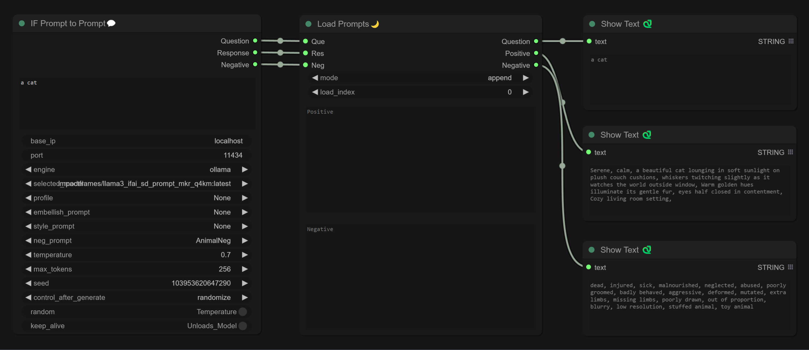

This plugin works with [IF_AI_Tools](https://github.com/if-ai/ComfyUI-IF_AI_tools) to build a workflow in ComfyUI that uses AI to assist in generating prompts.

The Load Prompts node features the following functionalities:

1. Automatically saves prompts to the root directory of the plugin (generates a file named `ai_prompts.json` in the root directory, storing parameters: question, positive, negative, and index).

2. Offers three saving modes: append, rewrite, and clear.
   1. append mode: Sequentially saves generated prompts; this mode becomes inactive when the IF Prompt to Prompt node is disabled.
   2. Rewrite mode: Overwrites all previous prompts with each new generation; this mode is also deactivated when the IF Prompt to Prompt node is disabled.
   3. Clear mode: Similarly overwrites all previous prompts upon each generation, but remains effective even if the IF Prompt to Prompt node is disabled.

3. load_index: Retrieves prompts corresponding to the specified index from `ai_prompts.json`.

4. Includes separate input fields for Positive and Negative prompts, which are placed at the beginning of the sequence. These fields incorporate a deduplication function, using "," as a delimiter to eliminate any duplicate prompts.
